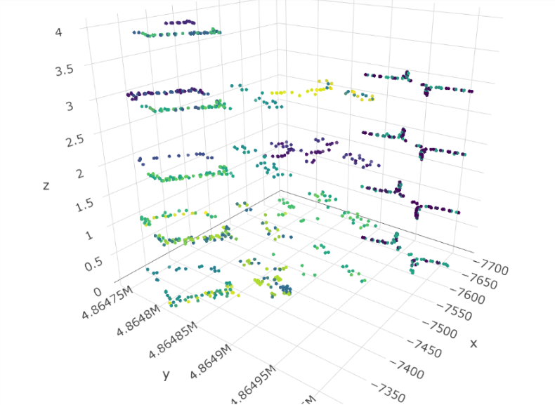
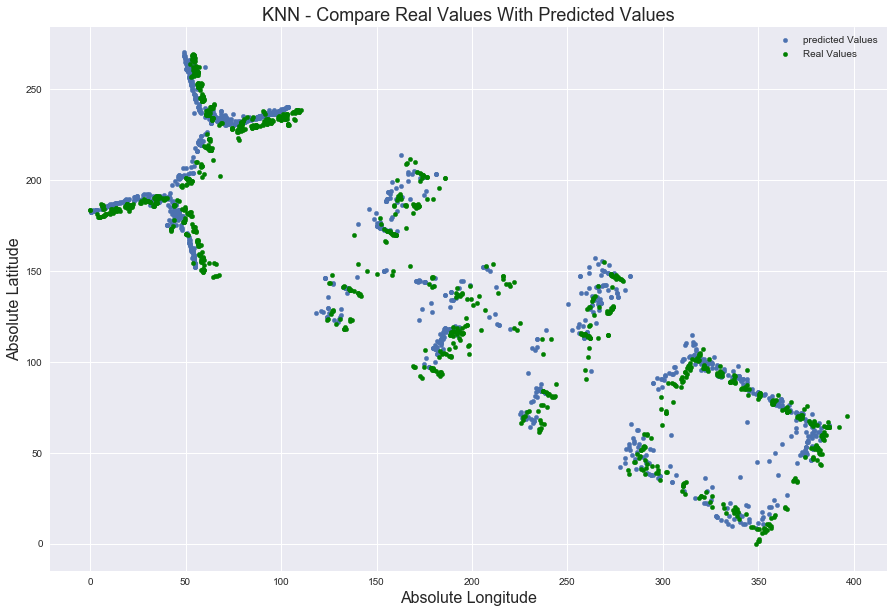

  

<h2>Python script for indoor locationing using Wi-Fi signals</h2>

### Evaluate Techniques for Wifi Locationing

Indoor locationing: Determining a person’s physical position in a multi-building indoor space using wifi fingerprinting. 
I used this Data Set for training and evaluation: [UJIIndoorLoc Data Set](http://archive.ics.uci.edu/ml/datasets/UJIIndoorLoc)

 

### Visualization of UserID by Building & Floor Using Coordinates

 

### Predicted and Actual Longitude and Latitude Coordinates

